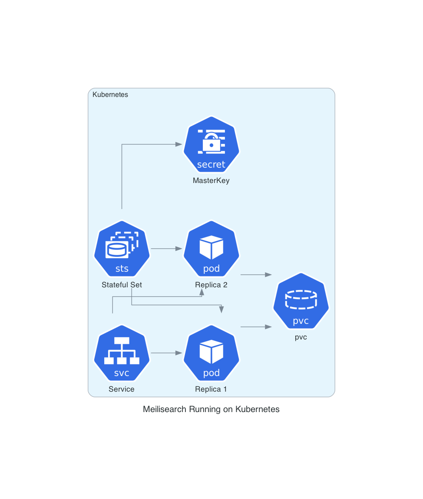
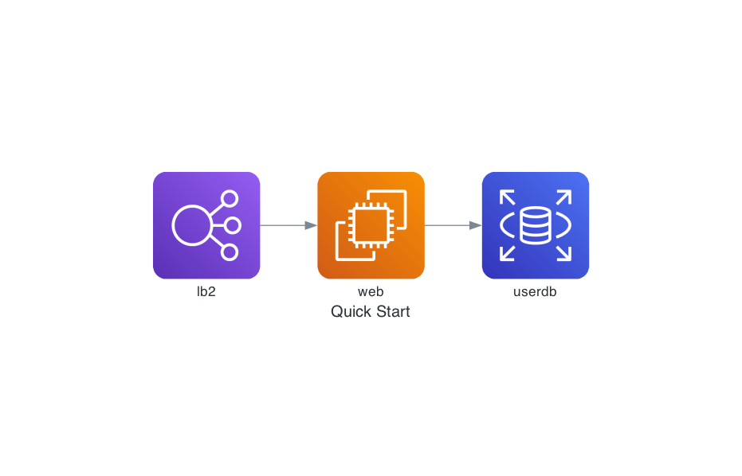

# python-diagrams

Sandbox for showing python diagram capabilities with commonly found architecture. 

## Usage

```bash
python {diagram}.py 

# e.g. 
python quick-start.py
```

A PNG image of the diagram will be created next to the diagram script invoked.

## Install 

```bash
poetry shell
poetry install 
```

[GraphViz](https://formulae.brew.sh/formula/graphviz) will also need to be installed.

## Examples

### K8s Meilisearch 



### Web Service 


